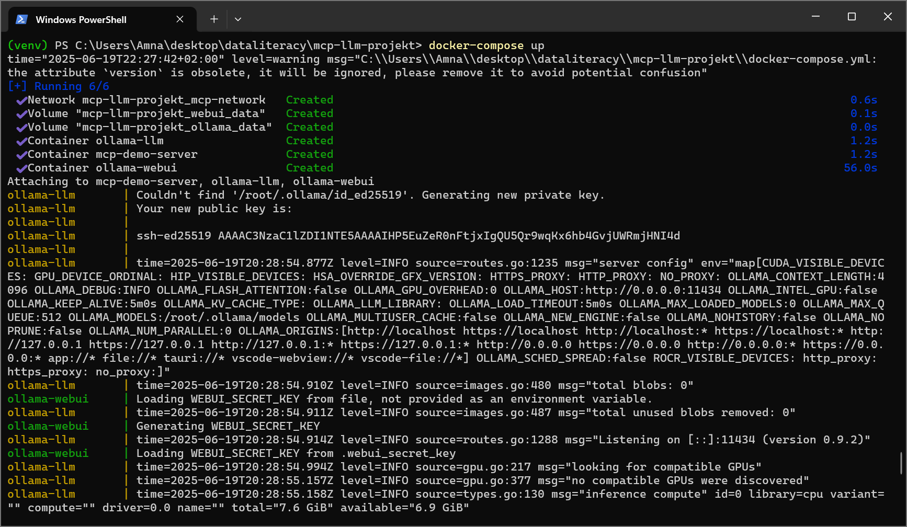
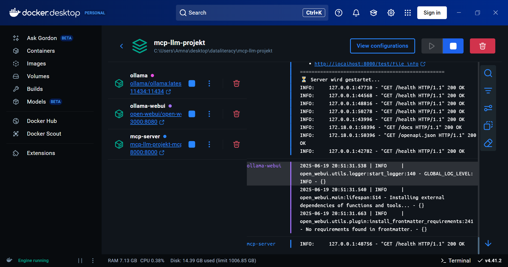

# local-llm-mcp-integration

Local LLM deployment using Docker, Ollama and a custom MCP server with REST-based API integration.

---

## Stack

- Python 3.11
- FastAPI
- Uvicorn
- Docker & Docker Compose
- Ollama (Mistral)
- REST API
- OpenAPI / Swagger

---

## Architecture

FastAPI MCP Server → Ollama → Mistral Model → JSON Response

The MCP server exposes structured tool endpoints which internally communicate with a locally deployed LLM via Ollama.

---

## Project Structure

```
.
├── mcp_server.py
├── requirements.txt
├── Dockerfile
├── docker-compose.yml
├── index.html
├── images/
└── README.md
```

---

## Endpoints

- `GET /health` – Health check
- `GET /tools` – List available tools
- `POST /call-tool` – Execute tool
- `GET /test/{tool_name}` – Tool test endpoint
- `GET /docs` – Swagger UI

---

## Run the Project

```bash
docker compose up --build
```

After startup:

FastAPI:  
http://localhost:8000

Swagger UI:  
http://localhost:8000/docs

Ollama API:  
http://localhost:11434

---

## Server Running



---

## Swagger API


---

## Health Check


---

## Docker Containers



---

## LLM Test via Curl


---

## Web Test Client


---

## What This Project Demonstrates

- Local LLM deployment
- Containerized AI infrastructure
- REST-based MCP server implementation
- FastAPI backend integration
- Tool-based architecture design
- Structured API exposure via OpenAPI
- Health monitoring & container orchestration

---

## Author

University project – Local LLM Infrastructure & MCP Integration
